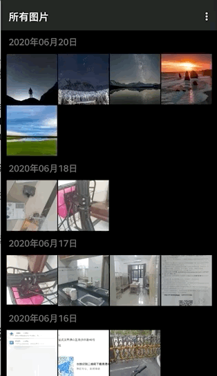

# 本地图片查看器
Android 图片查看器 by 字节跳动客户端训练营第5小组!

功能:

- 按日期展示图片

- 图片缩放

- 裁剪功能用到了ucrop库

- 支持局域网内图片传输,采用socket实现

  

其他

- 以前的v4,v7支持库不要用，统一用androidx
- androidstudio version 3.6.3
- gradle version 5.6.4-all

## 效果

选择->发送

接收(等待发送方连接)

接收文件

